# DX Usage Intelligence Dashboard

A Streamlit-based analytics dashboard developed during my internship at the **Centre for Data for Public Good (CDPG), Indian Institute of Science (IISc), Bangalore**.

The dashboard provides insights into the **IUDX Data Exchange** by collecting metadata from **Elasticsearch** and **Keycloak**, storing periodic snapshots, detecting changes over time, and presenting interactive visualizations along with a natural language assistant.

---

## Features

- 📊 Interactive analytics dashboard built with Streamlit
- 📦 Dataset analytics and metadata visualization
- 🏢 Provider and domain distribution analysis
- 📈 Historical trend analysis using snapshot comparison
- 🤖 AI Assistant for querying dashboard statistics in natural language
- 🔄 Automated snapshot collection from Elasticsearch and Keycloak
- 📜 Delta detection with alert logging
- ⏰ GitHub Actions workflow for scheduled snapshot generation
- 🎨 Responsive dashboard with reusable UI components

---

## Dashboard Pages

### 🏠 Home

- Platform overview
- Dataset statistics
- Registered user statistics
- Platform health
- Snapshot summary
- Recent changes
- Key insights

### 📊 Dataset Analysis

- Top domains
- Top providers
- Dataset type distribution
- Access policy distribution
- City distribution
- Detailed statistics

### 📈 Trends

- Historical snapshot comparison
- Dataset growth
- Provider growth
- User growth
- Interactive trend visualizations

### 🤖 AI Assistant

Ask natural language questions such as:

- How many datasets are available?
- How many users are registered?
- Which provider has the most datasets?
- Which domain has the most datasets?
- How many open datasets are there?
- How many dataset types are available?

---

# Project Architecture

```text
                  Elasticsearch
                         │
                  Aggregation Queries
                         │
                         ▼
                    fetch.py
                         │
          ┌──────────────┴──────────────┐
          │                             │
          ▼                             ▼
     Keycloak API              Elasticsearch Data
          │                             │
          └──────────────┬──────────────┘
                         ▼
                JSON Snapshot Storage
                         │
                         ▼
               Delta Detection Engine
                         │
                         ▼
                 Alert Log Generator
                         │
                         ▼
               Streamlit Dashboard UI
```

---

## Project Structure

```text
DX-Usage-Intelligence-Dashboard
│
├── .github/
│   └── workflows/
│       └── dashboard_scheduler.yml
│
├── docs/
│   └── screenshots/
│
├── pages/
│   ├── 1_Dataset_Analysis.py
│   ├── 2_Trends.py
│   └── 3_AI_Assistant.py
│
├── snapshots/
│
├── Home.py
├── assistant.py
├── dashboard_components.py
├── theme.py
├── utils.py
├── fetch.py
├── delta_detector.py
├── alert_manager.py
├── es_module.py
├── es_queries.py
├── keycloak_module.py
├── config.py.example
├── requirements.txt
├── README.md
└── LICENSE
```

---

# Technology Stack

### Frontend

- Streamlit
- Plotly
- Pandas

### Backend

- Python
- Elasticsearch REST API
- Keycloak Admin REST API

### Automation

- GitHub Actions
- Snapshot-based Data Pipeline

---

# Installation

Clone the repository

```bash
git clone https://github.com/<your-github-username>/DX-Usage-Intelligence-Dashboard.git
```

Navigate to the project

```bash
cd DX-Usage-Intelligence-Dashboard
```

Install the required packages

```bash
pip install -r requirements.txt
```

Create a configuration file from the template

```text
config.py.example
```

Rename it to

```text
config.py
```

Fill in your Elasticsearch and Keycloak credentials.

Run the application

```bash
streamlit run Home.py
```

---

# Screenshots

 Home    

 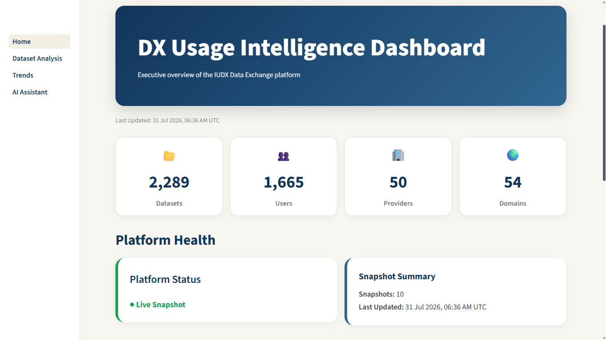 
 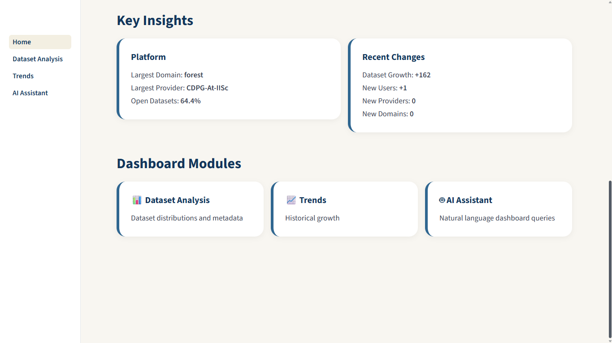 


 Dataset Analysis 

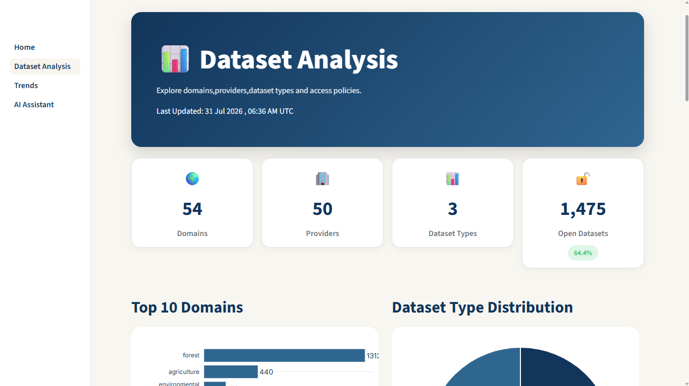 
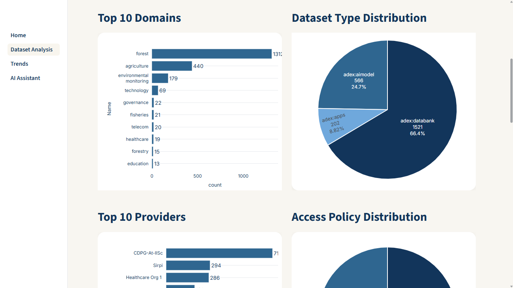 
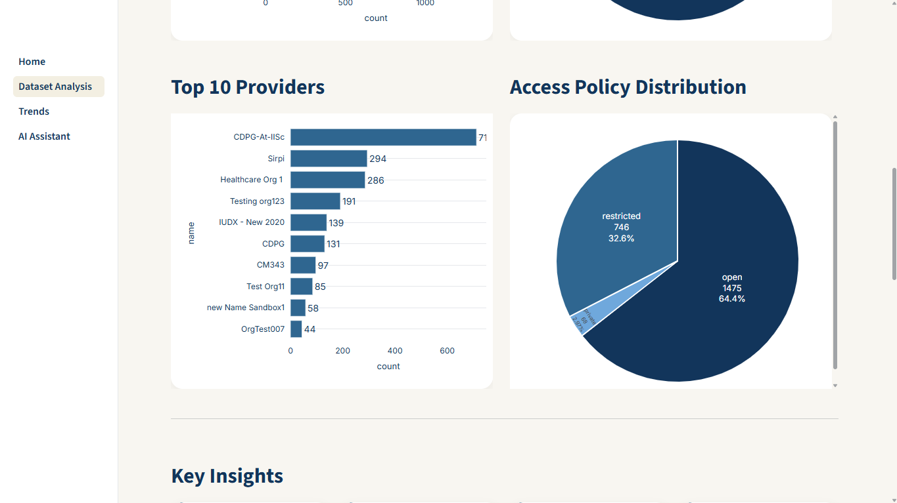 
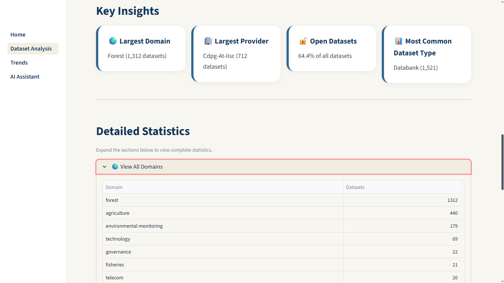 
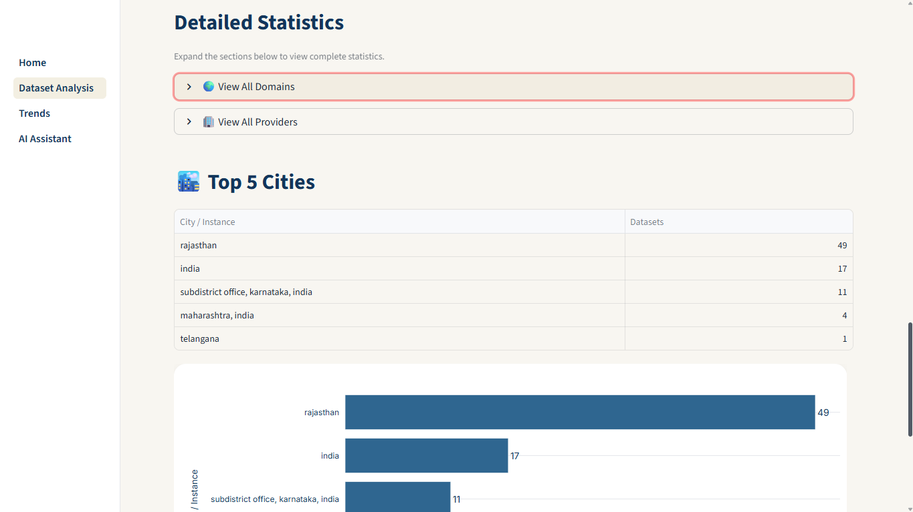 
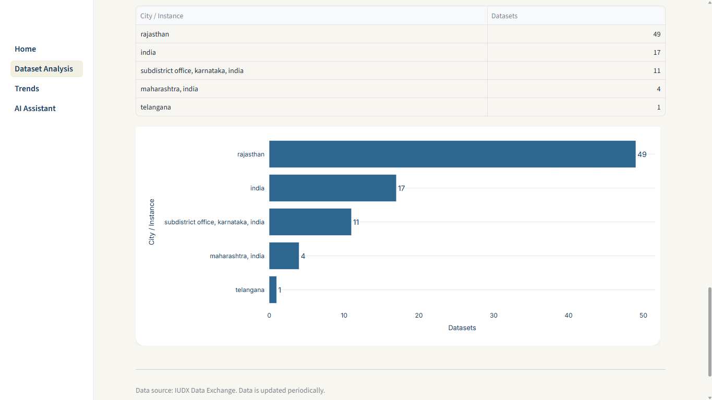 


 Trends   

 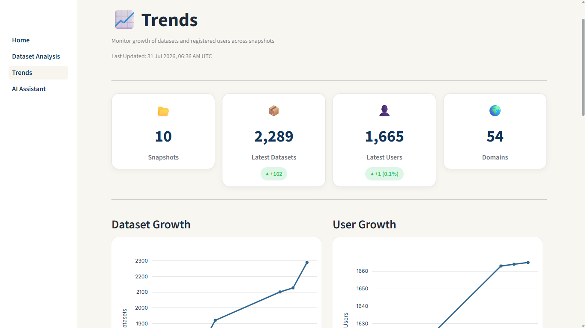 
 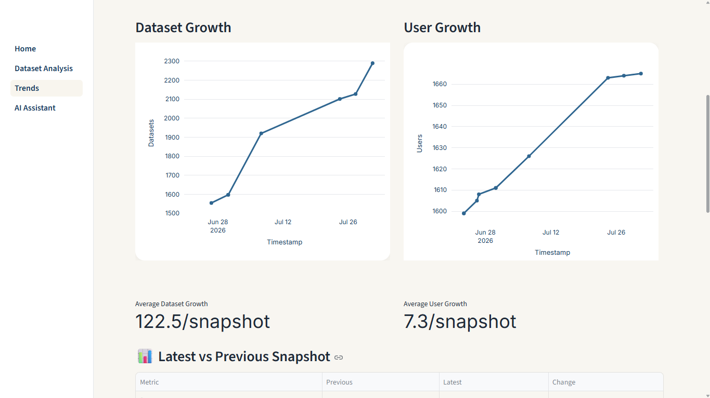 
 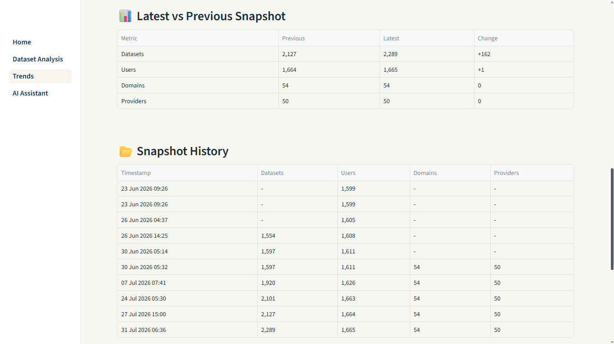 
 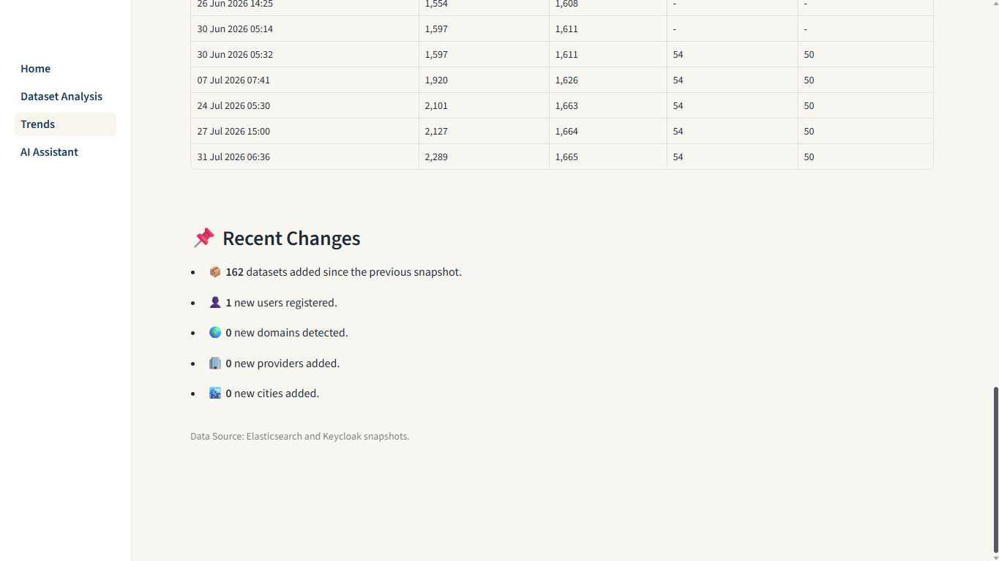 

 AI - Assistant 

 
 


# Snapshot Pipeline

The data collection workflow follows a snapshot-based architecture:

1. Fetch metadata from Elasticsearch.
2. Retrieve registered user statistics from Keycloak.
3. Generate a timestamped JSON snapshot.
4. Compare the latest snapshot with the previous snapshot.
5. Detect changes in datasets, providers, domains, and users.
6. Log detected changes to the alert log.
7. Refresh dashboard visualizations using the latest snapshot.

---

# Future Improvements

- Real-time dashboard updates
- Enhanced natural language query capabilities
- Slack or email alert integration
- Additional analytics and KPIs
- Support for multiple Data Exchange deployments
- Improved data normalization for metadata consistency

---

# Internship Information

**Organization:** Centre for Data for Public Good (CDPG), Indian Institute of Science (IISc), Bangalore

**Project Title:** DX Usage Intelligence Dashboard

**Internship Duration:** June 2026 – July 2026

---

# License

This project is licensed under the MIT License.

---

# Acknowledgements

I would like to express my sincere gratitude to the **Centre for Data for Public Good (CDPG), Indian Institute of Science (IISc), Bangalore**, for providing me with the opportunity to work on this project. This internship provided valuable hands-on experience in data analytics, Elasticsearch, Keycloak integration, automation pipelines, and dashboard development.

Special thanks to my mentors and the entire team at CDPG for their continuous guidance, valuable feedback, and support throughout the internship.